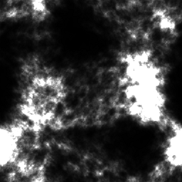

# Texgen

This is a part of [Node3D](https://github.com/node-3d) project.


> npm i -s texgen-raub

This works only with **THREE.JS**. [Live DEMO](http://gsom.tech/texgen).


## Synopsis

Method `THREE.generateTexture` is added.

Args:
```js
{
	resolution: number = 1024,
	renderer: THREE.WebGLRenderer,
	uniforms: Object = {},
	fragment: string = 'void main() {gl_FragColor = vec4(1.0, 0.0, 0.0, 1.0);}',
}
```

Returns: `{ texture: THREE.Texture, buffer: Uint8Array, ?error: string }`.

---

This is a procedural texture generator. You have to provide a piece of
fragment-shader code with at least the `main` function present.

The output is not necesserily seamless. But it is easy to achieve.


## Usage

```js
const fragment = `
void main() {
	vec3 uv3 = getUv3(varUv);
	gl_FragColor = vec4(vec3(pow(noise(uv3 + 9.4) * 1.7, 10.0)), 1.0);
}
`;
const { texture } = THREE.generateTexture({ renderer, fragment });
material.map = texture;
```

The following image is produced. Here it is easy to see the seamless edges:



More texture-like images are achieved with multiple layers of noise.
See [examples](examples.js) here. Also you can practice at the
[Live DEMO](http://gsom.tech/texgen) website.
There you can also download your results as PNG.

### GLSL API Details:

* `void main() {}` Required procedure
* `vec4 gl_FragColor` Output pixel color
* `vec2 varUv` varying UV coords [0; 1]
* `vec3 getUv3(vec2)` 3D seamless noise coords
* `sampler2D _grain` convenience grain texture
* `float noise(vec3`) coherent noise generator
* `float getSign(float)` -1 for negative, +1 otherwise
* `M_PI = 3.141592653`
* `M_2PI = 2.0 * M_PI`
* `M_PI2 = 0.5 * M_PI`
